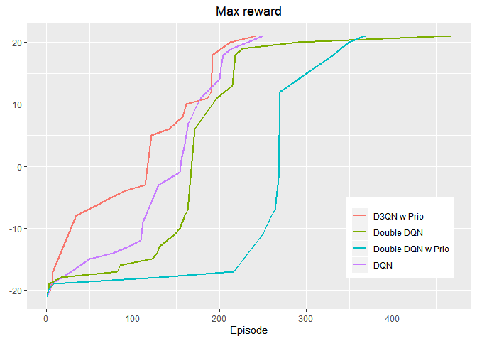
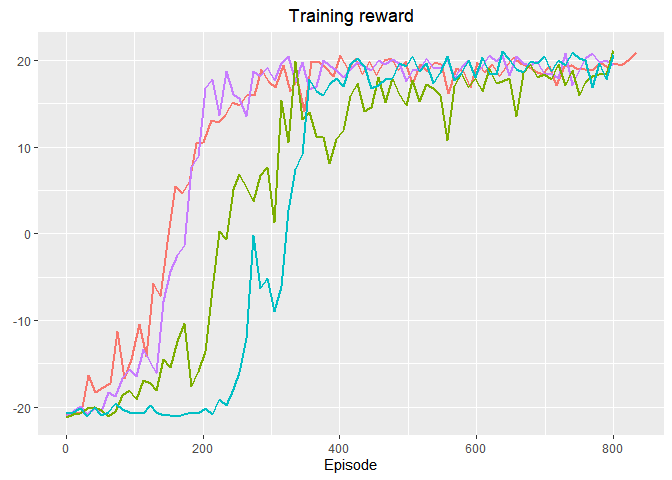
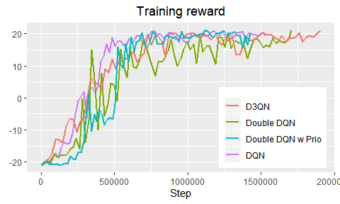

DQN
================

In this project, I have implemented the Deep Q Network presented by
DeepMind researchers in [the original
paper](https://www.cs.toronto.edu/~vmnih/docs/dqn.pdf) and follow-up
[Nature
paper](https://web.stanford.edu/class/psych209/Readings/MnihEtAlHassibis15NatureControlDeepRL.pdf).
I have also implemented several architectures that improve upon the
original DQN including [Double DQN](https://arxiv.org/abs/1509.06461),
[Prioritized Experience Replay](https://arxiv.org/abs/1511.05952) and
[Dueling DQN](https://arxiv.org/abs/1511.05952).

### Evaluation samples from Dueling Double DQN with Prioritized Replay Buffer:

|                                   Episode 50                                    |                                    Episode 150                                    |                                    Episode 750                                     |
| :-----------------------------------------------------------------------------: | :-------------------------------------------------------------------------------: | :--------------------------------------------------------------------------------: |
|  |  |  |

##### Resources used

This project would not have been possible without all the brilliant
resources available on the Internet. Among many, the following resources
has helped me the most:

  - [DQN tutorial for
    PyTorch](https://pytorch.org/tutorials/intermediate/reinforcement_q_learning.html)
      - Introductory tutorial to DQN that got me off the ground.
  - [OpenAI Baselines](https://github.com/openai/baselines)
      - Provides implementations of most Deep Reinforcement Learning
        algorithms written in Tensorflow. However, I used Baselines
        [ReplayBuffer](https://github.com/openai/baselines/blob/master/baselines/deepq/replay_buffer.py)
        to create ReplayBufferTorch and the wrappers available
        [here](https://github.com/openai/baselines/tree/master/baselines/common).
  - [Pre-processing of
    frames](https://danieltakeshi.github.io/2016/11/25/frame-skipping-and-preprocessing-for-deep-q-networks-on-atari-2600-games/)
      - Goes through the pre-processing Deepmind used in their DQN paper
        in great detail.
  - [Guide to speeding up
    DQN](https://medium.com/@shmuma/speeding-up-dqn-on-pytorch-solving-pong-in-30-minutes-81a1bd2dff55)
      - Excellent guide to speeding up the convergence of DQN, provides
        hyperparameters that works with the smaller replay buffer.

#### Hyperparameters

<!-- -->

<!-- -->

<!-- -->
