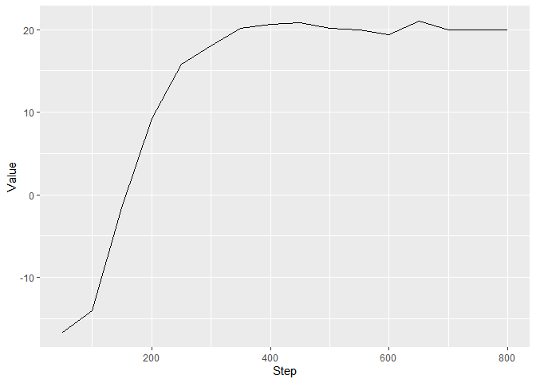
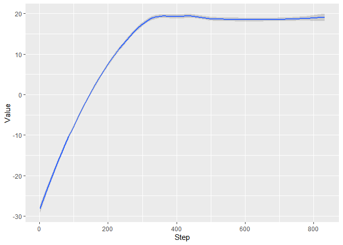

DQN
================

## Dueling Double DQN with Prioritized Replay Buffer

| Episode 50                                                                      | Episode 150                                                                       | Episode 750                                                                        |
| ------------------------------------------------------------------------------- | --------------------------------------------------------------------------------- | ---------------------------------------------------------------------------------- |
|  |  |  |

``` r
eval_reward = read.csv("Pong/DuelingDoubleDQNData/eval_reward.csv")
training_reward = read.csv("Pong/DuelingDoubleDQNData/training_reward.csv")
library(tidyverse)
```

    ## Warning: package 'tidyverse' was built under R version 3.6.3

    ## -- Attaching packages -------------------------------------------------------------- tidyverse 1.3.0 --

    ## v ggplot2 3.2.1     v purrr   0.3.4
    ## v tibble  3.0.3     v dplyr   1.0.1
    ## v tidyr   1.1.1     v stringr 1.4.0
    ## v readr   1.3.1     v forcats 0.5.0

    ## Warning: package 'tibble' was built under R version 3.6.3

    ## Warning: package 'tidyr' was built under R version 3.6.3

    ## Warning: package 'purrr' was built under R version 3.6.3

    ## Warning: package 'dplyr' was built under R version 3.6.3

    ## Warning: package 'forcats' was built under R version 3.6.3

    ## -- Conflicts ----------------------------------------------------------------- tidyverse_conflicts() --
    ## x dplyr::filter() masks stats::filter()
    ## x dplyr::lag()    masks stats::lag()

``` r
attach(eval_reward)
ggplot(eval_reward) + geom_line(mapping = aes(Step,Value))
```

<!-- -->

``` r
ggplot(training_reward) + geom_smooth(mapping = aes(Step,Value))
```

    ## `geom_smooth()` using method = 'loess' and formula 'y ~ x'

<!-- -->
