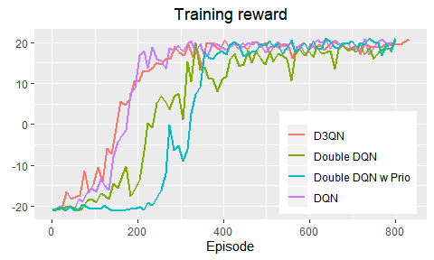

DQN
================

In this project, I have implemented the Deep Q Network presented by
DeepMind researchers in [the original
paper](https://www.cs.toronto.edu/~vmnih/docs/dqn.pdf) and follow-up
[Nature
paper](https://web.stanford.edu/class/psych209/Readings/MnihEtAlHassibis15NatureControlDeepRL.pdf).
I have also implemented several architectures that improve upon the
original DQN including [Double DQN](https://arxiv.org/abs/1509.06461),
[Prioritized Experience Replay](https://arxiv.org/abs/1511.05952) and
[Dueling DQN](https://arxiv.org/abs/1511.05952).

##### Resources used

This project would not have been possible without all the brilliant
resources available on the Internet. Among many, the following resources
has helped me the most:

  - [DQN tutorial for
    PyTorch](https://pytorch.org/tutorials/intermediate/reinforcement_q_learning.html)
    - introductory tutorial to DQN got me off the ground.
  - [OpenAI baselines](https://github.com/openai/baselines) - provides
    implementations of most Deep Reinforcement Learning algorithms. The
    downside is that they are written in Tensorflow. However, I used the
    baseline
    [ReplayBuffer](https://github.com/openai/baselines/blob/master/baselines/deepq/replay_buffer.py)
    to create ReplayBufferTorch and the wrappers available
    [here](https://github.com/openai/baselines/tree/master/baselines/common).
  - [Guide to speeding up
    DQN](https://medium.com/@shmuma/speeding-up-dqn-on-pytorch-solving-pong-in-30-minutes-81a1bd2dff55)

## DQN

| Episode 50                                                                 | Episode 200                                                                  | Episode 750                                                                   |
| -------------------------------------------------------------------------- | ---------------------------------------------------------------------------- | ----------------------------------------------------------------------------- |
|  |  |  |

## Dueling Double DQN with Prioritized Replay Buffer

| Episode 50                                                                      | Episode 150                                                                       | Episode 750                                                                        |
| ------------------------------------------------------------------------------- | --------------------------------------------------------------------------------- | ---------------------------------------------------------------------------------- |
|  |  |  |

<!-- -->

<!-- -->
